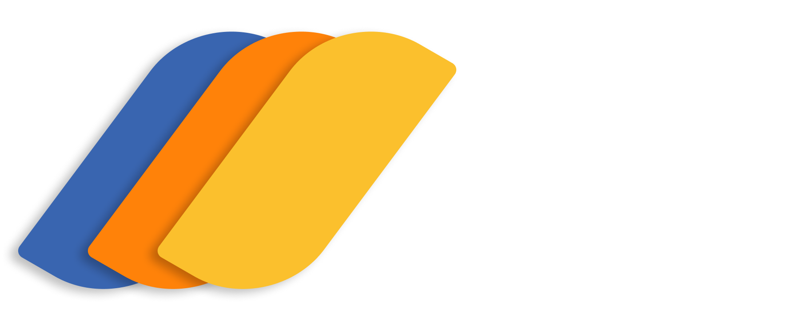

  

### **Cirq Studio**, an Graphical User Interface (GUI)   built for Google’s **Cirq** quantum framework. 
   

#### Unlike other quantum composers that abstract away the hardware, Cirq Studio is designed for the **NISQ (Noisy Intermediate-Scale Quantum)** era. It exposes the topology, timing, and constraints of real quantum processors (Sycamore), bridging the gap between high-level algorithms and hardware execution.

   

---
<h3> Built By: 
<a href="https://github.com/xavio2495">Immanuel</a> 
<a href="https://github.com/kevinchristopher619">Kevin Christopher</a>
</h3>

